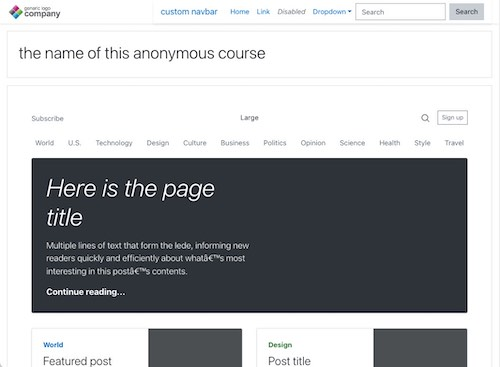

# Arid Theme

This theme extends Boost and is desgined for use in courses or categories where you want to show generic single-column page information and don't want to show most Moodle site features, such as when using Single Activity courses to display static pages or surveys.

It it not recommended to use this as a site-wide theme. Enable course/category theme support and apply it there only.

## Features

- Single column design
- Most features turned off

## Requires

- Boost
- Moodle 3.11+

### Hidden

- Username
- Language bar
- Blocks
- The sidebar
- Dock
- Footer
- Breadcrumbs
- Plugin outputs (e.g. Notifications popover)

## Settings

- Custom URL for the logo link (instead of the site homepage)
- Custom text for the header/logo (instead of the site name)
- Custom logo for the header (instead of the small site logo, if set)
- Custom SCSS and presets (similar to Boost)
- Custom html (raw) in the right navbar area (perhaps for a custom menu, links, etc)
- Custom html (raw) in the footer

## Licence

 http://www.gnu.org/copyleft/gpl.html GNU GPL v3 or later